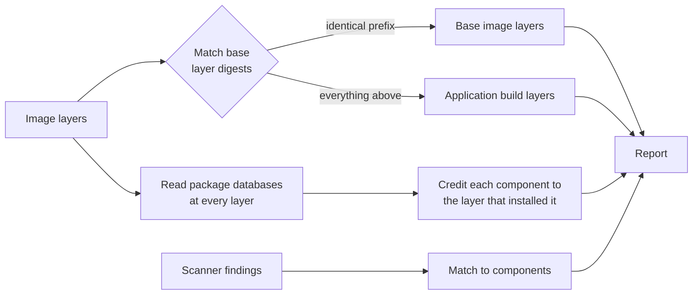

# How attribution works

A container image is a stack of layers. Each layer is a tar archive identified by the SHA-256 digest of its contents.
`wimi` unpacks the stack in build order and asks, for every component it finds: **which layer put this version here,
and who owns that layer?**

## Why the answer can be trusted

| Question                               | How `wimi` answers it                                                                                                                     | Strength of evidence                                         |
|----------------------------------------|-------------------------------------------------------------------------------------------------------------------------------------------|--------------------------------------------------------------|
| Which layers came from the base image? | Layer SHA-256 digests compared with known base images, from the [base image catalog](../guide/catalog.md) or `--base`                     | **Cryptographic proof** (identical digest = identical bytes) |
| Who installed each OS package?         | The RPM/dpkg/apk database is read at *every* layer, so each package is credited to the layer that installed its current version           | Exact                                                        |
| Who built and signed each RPM?         | Signing key ID from the package's OpenPGP signature, Vendor field, build host                                                             | Exact (e.g. `199E2F91FD431D51` = Red Hat release key 2)      |
| Which repository did it come from?     | dnf/microdnf history database (`ubi-9-baseos-rpms`, `epel`, `@commandline` ...)                                                           | Exact, when the history file is present                      |
| What about pip/npm/Maven/Go libraries? | Their own metadata (`dist-info`, `package.json`, `pom.properties`, Go build info)                                                         | Exact                                                        |
| What about loose binaries?             | Every executable is checked against all package file lists; anything unowned is flagged with its SHA-256 and the build step that added it | Exact as far as the build step                               |
| Who introduced each CVE?               | Each finding from your scanner (Trivy, Grype, or Harbor's built-in scan) is matched to the traced component                               | Exact when matched (shown per finding)                       |

## Layer by layer, not just the final image

Most tools look only at the finished filesystem. `wimi` reads the package database as it stood after **every** layer,
so it can tell:

* a package the base installed and the application left alone (credited to the **base**),
* a base package the application **upgraded** (credited to the **application build**, because that layer put the
  current version there),
* a package one layer installed and a later layer **removed** (listed separately, since it is no longer present),
* files a later layer only **re-owned or re-permissioned** (`chown -R`, `chmod -R`, `fix-permissions`): every file's
  contents are hashed, so a rewrite of the same bytes leaves the credit with the layer that first put them there. The
  layer view still shows how many files such a step touched.

This is what makes the split between "the base image's problem" and "the application team's problem" defensible.

## Build steps

Each layer's recorded build command is read from the image history and described in plain English. Risky practices
are flagged, such as piping a download into a shell (`curl | sh`), disabling package signature or TLS checks, and
world-writable permissions (`chmod 777`).

## Supplier evidence

For RPM-based images, `wimi` records the key that signed each package and recognises well-known vendor keys (for
example Red Hat's release keys, plus any keys imported into the image), along with the vendor field, build host and
source repository. Unsigned packages, packages signed by an unrecognised key, and RPMs installed from a loose file
rather than a vendor repository are called out as concerns.
